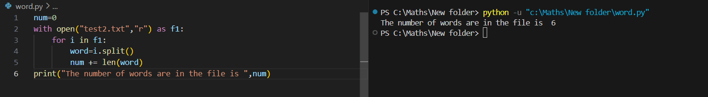

# Word-Count
## AIM:
To write a python program for getting the word count from a text.
## EQUIPEMENT'S REQUIRED: 
PC
Anaconda - Python 3.7
## ALGORITHM: 
### Step 1:
Create a new text file
### Step 2: 
Add some words to the file
### Step 3: 
Use the split function to split the words 
### Step 4:  
Count the words
### Step 5: 
Add them up
### Step 6: 
Display the values and end the program
## PROGRAM:
```
#Register no:212223240127
#Developed by: Priyadharshan S
num=0
with open("story.txt","r") as f1:
    for i in f1:
        word=i.split()
        num += len(word)
print("The number of words are in the file is ",num)
```
### OUTPUT:



## RESULT:
Thus the program is written to find the word count from a text.
